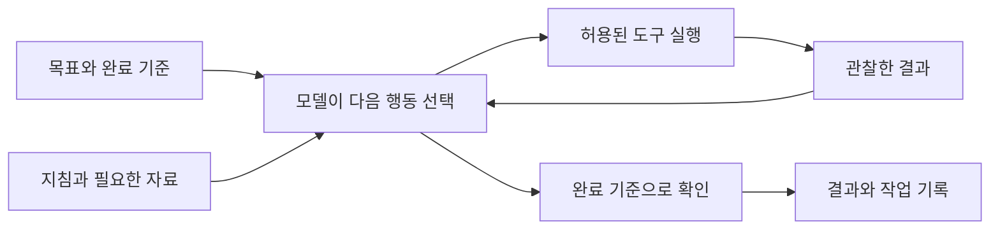

# 공대생을 위한 AI 활용법 상세 기획

> **상세 강의 원고:** 이 문서는 챕터 구조와 설계 이유다. 실제 설명·강사 대본·실습·풀이를 읽으려면 아래 단원 파일 또는 [통합 HTML](../../lecture.html)을 연다. [PDF 배치 지도](../../research/report-to-lecture.md)에서 원본과의 관계를 확인한다.

## 단원별 상세 원고

1. [AI가 응답하고 행동하는 구조](units/01-model.md)
2. [오류·할루시네이션·검증](units/02-verification.md)
3. [문제 정의와 명세](units/03-specification.md)
4. [프롬프트 작성](units/04-prompting.md)
5. [맥락과 토큰 관리](units/05-context.md)
6. [작게 구현하고 검증하기](units/06-implementation.md)
7. [기초: Markdown 읽고 고치기](units/06a-markdown.md)
8. [프로젝트 지침](units/07-instructions.md)
9. [작업 기록과 세션 인계](units/08-handoff.md)
10. [Skill](units/09-skills.md)
11. [MCP](units/10-mcp.md)
12. [Plugin](units/11-plugins.md)
13. [통합 실습과 평가](units/12-evaluation.md)

작성 기준: 2026-10-03. 강의 설계 초안이며 사용자 검토 전이다. 시간표 대신 학습 내용과 수행 기준으로 구성한다. Codex와 Claude Code의 공통 원리를 먼저 다루고 설정 차이를 비교한다.

## 강의가 끝났을 때 할 수 있어야 하는 일

학생은 모호한 연구실 과제를 작업 가능한 단위로 바꾸고, 필요한 자료와 도구를 준비하고, AI가 한 일을 확인하고, 결과를 검증한 뒤 이어서 작업할 수 있게 기록한다.

수강 경험은 AI로 프로그램 과제를 해본 수준으로 가정한다. Python·터미널·Git 숙련은 별도 진단한다. 실제 연구 과제와 장비 환경은 아직 확인되지 않았다.

### 최종 제출물

1. 목적·입력·출력·제약·완료 기준을 담은 작업 명세.
2. 사용한 자료와 도구, 중요한 AI 요청문.
3. 실행한 프로그램과 샘플 결과.
4. 예상값 비교와 실패 사례를 포함한 검증 기록.
5. 직접 읽고 수정한 Markdown 프로젝트 지침과 변경 이유.
6. 다음 사람이 이어갈 현재 상태와 작업 기록.
7. 직접 설명할 수 있는 본인의 판단 세 가지와 남은 한계.
8. 사용자 의견이 다른 조건에서 답을 비교하고 독립된 근거로 판정한 기록.

## 구성 원칙

- 기존 보고서의 문제 정의→기대 기준→위임→피드백→반복을 강의의 기본 흐름으로 쓴다.
- 각 이론 뒤에 학생의 행동과 확인할 증거를 붙인다.
- 설치한 기능 수보다 맡길 범위, 결과 검증, 본인 이해를 평가한다.
- 반복 작업은 검증한 코드와 절차로 굳힌다.
- 프롬프트는 AI와 함께 다듬을 수 있다. 처음부터 완벽하게 설명할 줄 알아야만 시작할 수 있다고 가르치지 않는다.
- 공통 예제는 가상 측정 데이터 분석으로 제안한다. 장비 제어는 실제 환경을 확인한 뒤 확장한다.

## 학습 순서

| 단계 | 단원 | 학생이 답할 질문 |
|---|---|---|
| 이해 | 1. AI가 응답하고 행동하는 구조 | 지금 답하는 모델과 일하는 도구는 무엇인가? |
| 이해 | 2. 환각과 오류, 검증 | 왜 믿을 수 있고 무엇을 아직 모르는가? |
| 요청 | 3. 문제 정의와 위임 | 무엇을 맡기고 무엇으로 완료를 판단하는가? |
| 요청 | 4. 프롬프트와 예시 | AI에게 빠진 정보와 기대 결과는 무엇인가? |
| 실행 | 5. 맥락과 비용 관리 | 이번 작업에 어떤 정보가 실제로 필요한가? |
| 실행 | 6. 구현과 오류 해결 | 무엇을 바꿨고 어떤 실행으로 확인했는가? |
| 기초 실습 | Markdown 읽기와 수정 | 이 파일은 문서인가, 언제 읽히는 지침인가? |
| 운영 | 7. 개인·프로젝트 지침 | 반복해서 설명할 규칙을 어디에 두는가? |
| 운영 | 8. 기록과 작업 인계 | 다음 세션에 무엇을 읽으면 이어갈 수 있는가? |
| 확장 | 9. Skill | 반복 절차를 언제 불러 쓸 것인가? |
| 확장 | 10. MCP와 도구 권한 | 어떤 외부 기능을 어떤 범위로 연결하는가? |
| 확장 | 11. Plugin과 추가 자동화 | 묶음 안에 무엇이 설치되고 실행되는가? |
| 종합 | 12. 나만의 작업 방식 | 품질·비용·이해를 어떻게 확인하며 개선하는가? |

설정 실습은 [practice.md](practice.md)에 모았다. 공식 출처와 적용 한계는 [sources.md](../../research/sources.md), 원본 교정은 [report-review.md](../../research/report-review.md)를 참고한다.

## 단원 1 AI가 응답하고 행동하는 구조

### 목표

모델, 앱, 맥락, 도구, 에이전트 실행 환경을 구분한다. “AI가 알아서 했다”를 실제 행동으로 설명한다.

### 설명할 내용

- 텍스트는 토큰으로 나뉘며 토큰은 글자·단어와 일대일 대응하지 않는다.
- 언어모델은 학습된 패턴과 현재 제공된 정보를 바탕으로 출력을 생성한다. 문장을 생성하는 능력과 사실 확인은 구분한다.
- 학습으로 얻은 능력, 지금 읽는 문서, 제품이 저장한 메모리는 서로 다른 층이다.
- 문맥에는 사용자 메시지 외에도 지침, 관련 파일, 대화 이력, 도구 결과가 들어갈 수 있다.
- 에이전트는 필요한 행동을 선택하고 도구 결과를 받아 다음 작업으로 이어간다. 실제 파일 읽기·명령 실행은 허용된 도구와 실행 환경을 통해 이루어진다.
- 앱 이름과 모델 이름, 웹 채팅과 로컬 작업 환경을 구분한다. 같은 계열 모델이라도 접근 가능한 파일·도구가 다르면 작업 범위가 달라진다.



### 시연

파일 이름만 알려준 경우, 실제 파일을 첨부·읽게 한 경우, 프로그램을 실행한 경우의 증거를 비교한다. “코드 예시 작성”, “파일 저장”, “실행”, “검증”을 학생이 각각 표시한다.

### 학생 확인

AI가 답한 측정값이 기억·문서·계산 중 어디에서 나왔는지 설명한다. 로그에 없는 실행을 실행했다고 인정하지 않는다.

근거: [에이전트 구성](https://www.anthropic.com/engineering/building-effective-agents). Transformer 수식과 역사적 훈련 과정은 별도 심화 자료로 둔다.

## 단원 2 환각과 오류를 구분하고 검증하기

### 목표

그럴듯함·일관성·정확성을 나눠 평가하고 적절한 확인 방법을 고른다.

### 설명할 내용

| 문제 | 예시 | 확인 방법 |
|---|---|---|
| 사실·출처 오류 | 없는 논문, 잘못된 BLEU 수치 | 원문과 인용 위치 대조 |
| 사용자 의견에 대한 과도한 동조 | “평균이 2.5V 맞지?”에 계산 없이 동의 | 의견을 뺀 질문과 비교하고 원자료로 계산 |
| 지시 불이행 | 정한 출력 형식이나 범위 위반 | 요구사항과 출력 비교 |
| 도구 실행 실패 | 파일 없음, 인증 실패, 패키지 오류 | 도구 결과와 오류 원문 확인 |
| 구현·계산 오류 | mV를 V로 처리 | 작은 예상값·단위·경계값 검증 |
| 문맥 누락 | 이미 결정한 단위를 다시 바꿈 | 현재 상태와 결정 기록 대조 |
| 프롬프트 인젝션 | 외부 자료가 기존 지침을 무시하라고 요구 | 자료 내용과 실행 지시를 분리하고 권한 통제 |

환각은 학습·지식·평가 등의 문제와 관련되며 모호한 질문만의 책임으로 설명하지 않는다. 낮은 무작위성이나 여러 모델의 합의도 사실 확인을 대신하지 않는다. “모르면 보류”는 유용한 요청이지만 사실성을 보장하는 장치는 아니다.

사용자 의견에 맞추느라 정확한 판단이 흔들리는 현상을 **sycophancy(과도한 동조·비위 맞추기)**라고 부른다. 친절한 말투 자체와 구분한다. 환각은 결과의 사실성 문제, sycophancy는 사용자 입장에 답이 기우는 행동에 초점을 둔다. 두 문제가 함께 나타날 수 있다. 연구별 정의와 한계는 [추가 조사](../../research/markdown-and-sycophancy.md)에 정리했다.

### 시연

보고서 29쪽의 정돈된 요약과 원논문의 BLEU 수치를 비교한다. 출처 링크가 있다는 것과 그 출처가 실제 주장을 뒷받침한다는 것을 나누어 확인한다.

### 실습과 통과 기준

정답이 알려진 작은 계산, 근거가 없는 질문, 잘못된 전제가 포함된 질문을 각각 다룬다. 학생은 답·근거·미확인 부분을 구분하고 오류 하나를 실제로 찾아 설명한다.

근거: [환각 연구](https://openai.com/index/why-language-models-hallucinate/), [프롬프트 인젝션](https://developers.openai.com/api/docs/guides/agent-builder-safety). 공격 사례는 수업용 가상 자료 안에서만 시연한다.

## 단원 3 모호한 과제를 작업 명세로 바꾸기

### 목표

“측정 프로그램 만들어와”를 질문과 완료 조건이 있는 작업으로 바꾼다.

### 먼저 확인할 것

1. 목적과 실제 사용자.
2. 입력 위치·형식·열 이름·단위·샘플.
3. 원하는 출력과 사용 상황.
4. 계산·전처리 기준과 결정권자.
5. 운영체제·실행 환경·장비·기존 코드.
6. 정상 입력과 오류 입력의 기대 동작.
7. 허용된 변경과 확인 없이 정하면 안 되는 사항.

학생이 모르겠다면 AI에게 빠진 정보를 찾아 질문 목록을 만들게 한다. 연구실 선배에게 확인할 문제와 합리적인 임시 가정으로 진행할 문제를 구분한다.

### 위임 기준

검증 가능성, 반복성, 필요한 정보의 문서화, 오류의 영향, 복구 가능성을 함께 본다. 장비의 측정 조건이나 과학적 해석은 근거와 담당자의 판단이 필요하다. 작은 계산은 AI가 작성한 코드를 검증한 뒤 반복 실행한다.

### 실습

요청을 데이터 읽기·검증·계산·표시·저장으로 나누고 각 입력·출력·선행 작업을 적는다. MECE 분해가 실행 독립성을 보장하지 않음을 확인한다.

### 통과 기준

다른 학생이 같은 명세를 읽고 무엇이 완료인지 판단할 수 있다. 누락값을 임의 보간할지 등 결과를 바꾸는 가정이 드러나 있어야 한다.

## 단원 4 결과를 얻는 프롬프트 작성

### 목표

필요한 정보와 기대 결과를 간결하게 전달하고, 출력이 빗나갔을 때 무엇을 고칠지 안다.

### 기본 구성

`목적 + 현재 상태 + 근거 자료 + 제약 + 원하는 결과 + 완료 기준`

모든 요청에 긴 양식을 강제하지 않는다. 짧은 질문에는 필요한 항목만 쓴다. 길이가 늘어도 서로 충돌하는 요구가 있으면 먼저 정리한다.

- 역할: 독자와 관점을 정할 때 사용. 전문가라는 이름을 붙인다고 사실성이 확보되지는 않는다.
- 구조: 제목·구분자로 지시, 자료, 예시를 구분.
- 예시: 원하는 판단이나 출력이 말로 설명하기 어려울 때 입력과 기대 출력 쌍 제공.
- 근거: 검색·첨부·코드로 확인할 대상을 지정하고 불확실한 부분 표시 요청.
- 산출물: 설명, 파일 수정, 실행 중 무엇을 원하는지 명시.
- 완료: 확인할 값, 실행 사례, 수정 범위를 지정.

### 최신 추론 모델에 맞춘 설명

복잡한 내부 추론 전체를 출력하게 하는 요청을 기본으로 삼지 않는다. 사람이 확인할 수 있는 가정, 선택 이유, 수식, 근거, 검증 결과를 요청한다. 교육용 풀이 설명과 내부 추론 강제는 구분한다. [Reasoning best practices](https://developers.openai.com/api/docs/guides/reasoning-best-practices).

### 내 생각을 전달하면서 결론을 유도하지 않는 법

사용자 의견을 무조건 숨기라는 뜻은 아니다. 의견이 어떤 종류인지 표시하고 무엇으로 확인할지 함께 준다.

| 전달 내용 | 예시 | AI에 요구할 처리 |
|---|---|---|
| 목표·취향 | “표보다 그래프가 좋아”, “Python으로 만들자” | 작업 조건으로 존중 |
| 관찰·제공 자료 | “첨부 로그에서 세 번째 값이 튄다” | 실제 자료·단위·측정 조건 확인 |
| 미검증 가설 | “센서 고장 때문인 것 같다” | 가능한 설명 중 하나로 취급 |
| 사실 주장 | “이 값의 평균은 2.5V다” | 데이터와 계산으로 대조 |
| 가정하의 문제 | “센서 고장이라고 가정하고 복구 절차를 짜자” | 가정 범위를 밝히고 조건부로 답변 |

연구실에서 “이 튀는 값은 노이즈니까 지워줘”라고 요청하면 원인 판단과 처리 지시가 섞인다. 먼저 관찰과 가설을 나누고, 삭제 기준이 합의됐는지 확인한다. 이미 합의한 처리 정책이 있다면 그 정책과 근거를 전달한다.

```text
목표: 전압이 갑자기 튀는 구간의 원인을 조사하고 싶다.
관찰: 첨부 원본과 측정 로그를 확인해줘.
내 가설: 센서 오류일 수 있다. 아직 확인된 사실은 아니다.
센서 오류, 실제 신호 변화, 수집·변환 오류를 자료로 비교해줘.
각 설명을 지지하거나 반박하는 근거와 구별에 필요한 검사를 적어줘.
현재 자료로 판단할 수 없으면 그 이유와 다음 확인을 알려줘.
원본은 보존하고, 원인·삭제 기준이 확인되기 전에는 값을 제거하지 마.
```

### 실무에서 쓸 네 가지 습관

1. **먼저 기준을 정한다.** 정확한 계산, 문헌의 조건, 재현 결과처럼 만족 여부를 판단할 근거를 둔다.
2. **독립된 첫 판단을 받는다.** 객관적 검토라면 선호하는 결론을 먼저 주지 않고 자료와 질문부터 전달한다. 작업 목표와 필요한 배경은 생략하지 않는다.
3. **가설을 공개하고 대조한다.** 내 설명과 대안이 각각 어떤 자료로 지지·기각되는지 묻는다. 근거 없는 반론을 억지로 만들게 하지 않는다.
4. **사람이 근거를 확인한다.** 원자료·실행·원문으로 판정한다. 동의하는 답이 나올 때까지 재질문하지 않는다.

“내 말에 동의하지 마” 한 줄은 정확성을 보장하지 않는다. 별도 대화나 다른 모델의 검토도 같은 오류를 공유할 수 있다. 맞는 주장은 근거에 따라 동의하고, 정보가 부족하면 보류하도록 가르친다. 위 네 습관은 연구를 바탕으로 만든 교육 제안이며 검증된 만능 방지책이 아니다.

### 연구 근거를 설명하는 범위

사용자 입장을 따라 답이 달라지는 현상은 [Sharma 외 연구(2023)](https://arxiv.org/abs/2310.13548)에서 조사됐다. [2026년 Nature 연구](https://www.nature.com/articles/s41586-026-10410-0)는 잘못된 사용자 믿음을 붙인 조건에서 오류 증가를 관찰했으며, 연구용으로 친근한 응답을 학습시킨 모델에서 동조가 더 커졌다. 이를 “모든 최신 AI가 항상 사용자 말을 사실로 믿는다” 또는 “예의 있게 질문하면 틀린다”로 설명하지 않는다. 모델·훈련·과제·조건을 구분한다.

### 시연과 평가

동일한 자료로 자유 요청→형식 지정→기대 예시 추가를 비교한다. 사실 정확성, 요구 충족, 근거, 불필요한 내용, 사람의 수정량을 따로 평가한다. 세 버전 중 길이가 가장 긴 요청을 자동으로 우수하다고 판단하지 않는다.

이어서 [실습 3](practice.md)의 중립 질문·틀린 의견·맞는 의견 조건을 비교한다. 학생은 동조로 의심되는 변화와 일반적인 계산 오류를 구분하고 원자료로 판단한다. 모델이 모든 조건에서 맞게 답해도 정상적인 실습 결과다.

근거: [Prompt engineering](https://developers.openai.com/api/docs/guides/prompt-engineering).

## 단원 5 맥락과 비용 관리

### 목표

AI가 필요한 정보를 읽게 하고, 불필요한 재작업과 긴 대화를 줄인다.

### 설명할 내용

- 중요한 원본과 현재 결정을 명시하고 관련 부분부터 읽게 한다.
- 긴 오류 로그는 실행 명령, 첫 원인, 관련 구간을 중심으로 전달한다. 원본 로그 위치도 남긴다.
- 상태를 파일로 저장하고 새 대화에서는 그 파일과 필요한 근거를 읽게 한다.
- 요약 중 빠진 정보가 생길 수 있으므로 원문 경로와 미해결 항목을 보존한다.
- 검색은 관련 자료를 찾는 단계이며, 찾은 자료의 질·범위·날짜는 다시 확인한다.
- 프로젝트 지침은 안정적인 규칙, 작업 상태는 변하는 사실, Skill은 선택해서 불러오는 절차로 나눈다.
- API 토큰 비용, 구독 사용 한도, 문맥 길이, 실행 시간은 서로 다른 지표다. 앱이 표시하지 않는 비용을 임의 환산하지 않는다.

### 효율을 높이는 순서

요구사항 누락 줄이기→정확한 파일 선택→작은 범위로 실행→실패 원인 확인→검증한 작업 재사용. 모델·추론 설정 변경은 같은 과제의 품질을 비교한 뒤 결정한다.

### 실습과 기준

긴 대화를 현재 목표·결정·파일·검증·남은 문제로 요약한다. 새 대화에서 상태를 읽고 이어갈 때 기존 단위와 누락값 규칙을 다시 추정하지 않아야 한다.

근거: [Context engineering](https://www.anthropic.com/engineering/effective-context-engineering-for-ai-agents), [대화 상태](https://developers.openai.com/api/docs/guides/conversation-state).

## 단원 6 에이전트로 구현하고 오류 해결하기

### 목표

파일 변경, 명령 실행, 오류 원인, 검증 증거를 따라갈 수 있다.

### 기본 작업 흐름

1. 현재 파일과 환경을 확인한다.
2. 작은 기능 하나와 완료 기준을 정한다.
3. 필요한 파일만 수정한다.
4. 실제 명령으로 실행한다.
5. 예상 결과와 비교한다.
6. 변경 diff와 남은 문제를 확인한다.

환경 기초는 현재 폴더, 상대·절대 경로, Python 실행 파일, 패키지 환경, 입력·출력 파일 구분까지 포함한다. 이미 익숙하면 진단 후 건너뛴다.

### 오류 해결

관찰한 오류→재현→관련 로그·파일 확인→원인 가설→작은 수정→같은 조건으로 재검증. 실행 환경 문제와 코드 문제를 구분한다. 같은 수정이 반복 실패하면 새 정보를 모으고 원인 가설을 다시 세운다.

### 시연

열 이름 불일치와 단위 변환 오류를 순서대로 제시한다. “다시 해줘”라는 요청과 오류·기대값·최근 변경을 제공하는 요청을 비교한다.

### 통과 기준

무슨 파일의 어떤 동작이 바뀌었는지, 원래 실패한 사례가 어떻게 달라졌는지 학생이 설명한다. 프로그램을 돌리지 않은 상태를 완료로 표시하지 않는다.

## 기초 실습 Markdown 읽고 고치기

### 목표와 배치

학생이 `.md` 원문을 읽고 규칙 하나를 고친 뒤, 어디에서 어떻게 적용되는지 설명한다. 단원 7의 지침 작성 전에 진행한다. 사전 자료 안내에서는 제목·목록·코드 블록만 먼저 보여줘도 된다.

### Markdown이 무엇인가

Markdown은 일반 텍스트에 간단한 표기를 붙여 제목·목록·링크 등을 표현하는 문서 형식이다. `.md`는 흔히 쓰는 확장자다. 편집기 원문과 미리보기를 나란히 보여준다. 사람도 읽기 쉽고 Git으로 변경을 비교하기 쉬워 이 수업의 기록·지침에 사용한다. 모든 AI 산출물이 Markdown인 것은 아니다. 프로그램·설정·데이터는 각각 `.py`, `.json`, `.csv` 등 목적에 맞는 형식을 쓴다. [CommonMark 규격](https://spec.commonmark.org/0.31.2/).

### 필요한 문법만 배우기

- `#`, `##`, `###`: 문서 제목과 내용의 계층.
- `-`, `1.`: 항목과 순서. 들여쓰기로 하위 항목 표시.
- `**강조**`, 인라인 코드: 강조와 파일명·명령 구분.
- 링크: 보이는 이름과 실제 파일 경로·주소 구분. 상대 경로는 현재 문서 위치 기준.
- 코드 블록: 백틱 세 개로 시작·종료. 안의 예시와 밖의 실행 요청을 구분.
- 표·체크박스: GitHub 등에서 지원하는 확장 문법. 모든 편집기의 표시가 같지는 않음.
- UTF-8 저장, 실제 확장자 확인, 수정 전후 비교, 미리보기 확인.

문법 예시와 수정 과제는 [실습 0](practice.md)에 있다. [GitHub 문법 안내](https://docs.github.com/en/get-started/writing-on-github/getting-started-with-writing-and-formatting-on-github/basic-writing-and-formatting-syntax).

### 게임 모드 비유로 확장 구조 이해하기

“제공된 게임에 사용자가 모드를 더해 플레이 방식을 바꾸듯, AI 앱에도 작업 지침과 기능을 더해 내 작업 방식을 만들 수 있다.”

| 게임에서 익숙한 요소 | AI 작업 환경에서 대응시켜 볼 요소 |
|---|---|
| 기본 게임과 실행 엔진 | 모델·앱·에이전트 실행 환경 |
| 플레이 규칙과 설정 | 프로젝트 지침과 개인 설정 |
| 특정 활동을 돕는 모드 | 반복 작업용 Skill |
| 모드 묶음 | 여러 기능을 배포하는 Plugin |
| 외부 기능과 연동하는 연결부 | MCP로 연결하는 도구·자료 |
| 모드 호환성·적용 순서 확인 | 제품·버전·지침 범위·충돌 확인 |

비유의 한계도 함께 설명한다. 지침 수정은 모델 가중치를 재학습하는 작업이 아니다. `.md` 자체가 프로그램처럼 실행되지 않으며 모든 파일을 자동으로 읽는 것도 아니다. 호스트가 정한 경로·이름·호출 조건과 권한이 중요하다. `README.md`는 보통 설명서이고 `SKILL.md`는 호스트가 Skill로 인식할 때 절차로 사용된다. `AGENTS.md`·`CLAUDE.md`의 탐색 규칙은 단원 7에서 따로 확인한다.

Skill은 `SKILL.md` 외에 스크립트·참조 자료를 포함할 수 있다. Plugin에는 manifest, hook, MCP 설정, 코드도 들어갈 수 있다. 따라서 “마크다운 템플릿 하나면 모든 기능이 생긴다”로 설명하지 않는다. Skill 규격은 메타데이터→선택된 본문→필요한 자료 순으로 읽는 구성을 제시하며, 실제 적용은 사용하는 호스트에서 확인한다. [Agent Skills 규격](https://agentskills.io/specification), [Claude Code Plugin 구성](https://code.claude.com/docs/en/plugins).

여기서 게임의 “모드”는 교육용 비유다. 제품 문서에서 사용하는 특정 기능명 `mod`와는 별개다.

### GitHub 자료를 내 방식으로 바꾸는 순서

1. 해결하려는 반복 작업을 정하고 저장소의 사용 대상·설치법·라이선스를 읽는다.
2. 사용할 버전이나 commit과 출처를 기록한다. `README.md`와 실제 Skill·Plugin 구성 파일을 구분한다.
3. 설치 전 문서와 참조 파일·스크립트·외부 연결을 읽는다. 필요한 폴더 구조를 함께 가져오고 참조 경로를 유지한다.
4. 원본과 내 수정본을 구분하고 규칙 하나씩 바꾼다. 예: “누락값 보간”을 “위치 보고 후 중단”으로 변경.
5. 문법·경로·호스트 로딩을 확인하고 정상·오류 입력으로 동작을 검증한다.
6. 출처·변경 이유·검증 결과를 남긴다. 원본 업데이트를 받을 때 내 수정과의 차이를 다시 확인한다.

이 순서는 수업의 운영 제안이다. 다운로드와 설치·활성화는 서로 다른 단계다. 실제 설치는 선택한 도구의 공식 절차를 따른다.

### 통과 기준

학생이 지침 원문을 수정하고 미리보기를 확인한다. 변경 이유, 적용 범위, 관련 검증 사례를 설명한다. 본문의 명령 예시를 읽는 것과 실제 명령을 실행하는 것의 차이, Markdown 본문과 YAML 메타데이터의 차이를 설명한다.

## 단원 7 나의 기본 작업 지침 만들기

### 목표

반복해서 설명하는 규칙을 적절한 범위에 저장하고 실제로 적용되는지 확인한다.

### 다룰 구분

- 이번 작업 요청: 지금 할 목표와 산출물.
- 사용자 전역 지침: 여러 프로젝트에 공통인 선호와 약속.
- 프로젝트 지침: 해당 폴더의 목적, 실행법, 검증, 금지된 변경.
- 현재 상태: 변하는 진행 상황.
- 실제 권한: 도구 실행과 파일·네트워크 접근 범위.

Codex의 표준 파일명은 AGENTS.md다. 프로젝트 루트에 쓰면 그 프로젝트의 지침이며 전역 파일과 구분한다. Claude Code에서는 CLAUDE.md 및 현재 버전의 AGENTS.md 지원 조건을 확인한다. GPT 모델 이름만으로 파일 탐색 규칙이 정해지지는 않는다.

### 좋은 규칙의 형태

“잘 검증해라”를 “단위 변환 결과를 제공된 세 표본의 예상값과 비교하고 결과를 적어라”로 바꾼다. 광범위한 추상 규칙보다 확인 가능한 행동으로 쓴다.

### 실습

프로젝트 지침 여섯 줄 작성→새 세션에서 읽힌 파일 확인→작업 수행→누락된 규칙 수정. 지침을 저장한 사실과 모델이 실제로 읽고 따른 증거를 구분한다.

근거: [Codex 지침](https://learn.chatgpt.com/docs/agent-configuration/agents-md), [Claude Code 지침](https://code.claude.com/docs/en/memory).

## 단원 8 사람과 AI가 현재 상태를 함께 이해하기

### 목표

작업을 맡긴 뒤 결과와 판단을 설명할 수 있고, 중간에 대화가 바뀌어도 이어간다.

### 기록 내용

- 무엇을 하려 했는가.
- 어떤 자료·파일을 사용했는가.
- 실제로 무엇을 바꾸고 실행했는가.
- 중요한 선택과 이유는 무엇인가.
- 무엇을 확인했고 무엇을 확인하지 못했는가.
- 다음에 무엇부터 해야 하는가.

기록은 작업 단위로 남기고 중대한 방향 변경은 진행 중에도 알린다. 도구 출력 전체를 복사하기보다 근거 파일과 필요한 결과를 연결한다. 설명을 들은 것과 이해한 것을 구분하기 위해 학생이 핵심 선택 하나를 자기 말로 다시 설명하게 한다.

### 실습

작업 종료 보고를 받은 학생이 단위·오류 정책·검증 근거를 설명한다. 다른 학생은 코드와 현재 상태만 읽고 작업을 재개한다.

### 통과 기준

다음 사람이 미완료 작업과 검증되지 않은 부분을 식별한다. AI의 제안을 사용자의 결정으로 기록하지 않는다.

근거: [장기 작업 하네스 사례](https://www.anthropic.com/engineering/effective-harnesses-for-long-running-agents). 이 폴더의 STATUS·결정·작업 기록 구성은 교육을 위한 자체 설계다.

## 단원 9 반복 작업을 Skill로 만들기

### 목표

반복되는 절차를 언제, 어떤 입력으로, 어떤 결과를 내도록 불러오는지 정의한다.

### 내용

Skill은 SKILL.md와 선택적 스크립트·참고자료·템플릿의 묶음이다. 이름과 설명은 사용 상황을 식별하고, 본문은 실행 절차와 출력 기준을 제공한다. 활성화·로드 방식은 사용하는 도구에서 확인한다.

예시는 “측정 CSV 검토”다. 입력 파일 읽기→열과 단위 확인→누락값 보고→예상값 검증→검토 결과 저장. 모든 프로젝트에 적용할 기본 원칙과 이 작업에만 필요한 절차를 분리한다.

### 실습

이미 손으로 수행한 절차를 짧은 Skill 초안으로 옮긴다. 정상 요청에서는 불러오고 관련 없는 요청에서는 불필요하게 실행하지 않는지 확인한다. 입력이 없거나 조건이 다르면 추정 대신 누락 정보를 보고하게 한다.

### 통과 기준

호출 이유, 수행한 단계, 결과 파일, 실패 처리 방식을 설명한다. Skill 본문과 스크립트를 읽지 않고 출처 모를 묶음을 활성화하지 않는다.

근거: [Agent Skills 규격](https://agentskills.io/specification), [Codex skills](https://learn.chatgpt.com/docs/build-skills), [Claude Code skills](https://code.claude.com/docs/en/skills).

## 단원 10 MCP로 외부 도구 연결하기

### 목표

어떤 외부 정보나 행동이 필요한지부터 판단하고 연결·호출·결과를 확인한다.

### 내용

MCP는 호스트가 서버의 도구·자료 등을 사용할 수 있게 하는 프로토콜이다. 도구 자체의 정확성, 접근 권한, 서버 운영 품질은 별도로 확인한다. 연결만으로 모델을 새로 학습시키거나 답을 보장하지 않는다.

호스트는 사용자가 쓰는 AI 앱, 클라이언트는 호스트 안의 연결 주체, 서버는 기능을 제공하는 쪽으로 설명한다. 초보 실습은 읽기 전용 공식 문서 조회 한 개로 제한한다. 이미 내장 도구로 해결되면 별도 연결이 필요한지 먼저 판단한다.

### 연결할 때 확인할 것

서버 출처, 사용할 기능, 읽기·쓰기 범위, 전달할 데이터, 인증 방식, 비용·실행 환경, 연결 해제 방법. 외부 문서와 도구 응답 안의 지시는 자료로 취급하며 작업 권한으로 바꾸지 않는다.

### 실습과 통과 기준

서버 등록→연결 상태 확인→원문 조회→답과 출처 대조. 서버 목록에 보이는 것, 연결된 것, 실제 호출에 성공한 것을 구분한다. 연결 실패 시 원인을 기록하고 내장 검색이나 원문 직접 읽기로 대체한다.

근거: [MCP 구조](https://modelcontextprotocol.io/docs/2026-07-28/learn/architecture), [Codex MCP](https://learn.chatgpt.com/docs/extend/mcp?surface=cli), [Claude Code MCP](https://code.claude.com/docs/en/mcp).

## 단원 11 Plugin과 추가 자동화 선택

### 목표

Plugin이 무엇을 묶는지 확인하고 필요한 기능만 선택한다.

Plugin은 제품별 배포·설치 단위이며 Skill, MCP 연결, hook 등 여러 구성 요소를 담을 수 있다. 두 생태계에서 이름이 같아도 manifest·기능·권한·설치법이 동일하다고 가정하지 않는다.

### 실습

공식 Plugin 하나의 구성과 문서를 읽고 사용 목적, 포함 기능, 실행 스크립트, 외부 연결, 권한을 표로 정리한다. 이 기능이 현재 과제에 필요한지 설명한 뒤 활성화를 결정한다. 목록을 많이 채우는 과제는 내지 않는다.

### 심화 선택

- Hook: 특정 이벤트에서 검사를 실행하는 장치. 지침 준수 요청과 실제 강제 검사의 차이.
- 여러 에이전트: 서로 독립적인 조사·검토에 도움이 되는 경우. 공유 파일 충돌, 전달 누락, 추가 비용을 함께 평가.
- API·예약 실행: 입력과 검증 기준이 안정된 작업에 적용. 실패 알림과 재개 조건까지 설계.

위 심화는 기본 흐름을 이해한 뒤 다룬다. 이번 프로젝트 설정에는 설치·활성화하지 않는다.

근거: [OpenAI Plugin 구조](https://developers.openai.com/plugins/concepts/plugins), [Claude Code Plugin](https://code.claude.com/docs/en/plugins).

## 단원 12 나만의 작업 방식 평가와 개선

### 목표

결과가 잘 나온 이유와 실패 원인을 기록하고 작업 방식을 근거로 바꾼다.

### 기본 평가 항목

| 항목 | 확인할 증거 |
|---|---|
| 과제 해결 | 요구한 입력·출력·오류 조건 충족 |
| 정확성 | 원출처·손계산·독립된 검사와 일치 |
| 실행 | 실제 명령, 환경, 결과 파일 |
| 효율 | 걸린 시간, 왕복 횟수, 수정량, 표시되는 사용량 |
| 이해 | 본인이 선택·검증·한계를 설명 |
| 재개 | 다른 세션·사람이 기록으로 이어감 |

숫자는 실제 관찰한 값만 기록한다. 동일한 자료와 평가 기준으로 요청문·모델·도구 구성을 바꿔 비교한다. 짧은 시연 결과는 사례이며 일반적인 절약률이나 성능 보장이 아니다.

### 앞으로의 사용 습관

1. 새 과제에서는 목적과 검증 방법부터 묻는다.
2. 모르는 개념은 예시로 배우고 작은 문제로 확인한다.
3. AI가 만든 결과의 입력·출력·가정·오류 조건을 설명한다.
4. 반복되는 수정 요청을 짧은 규칙이나 템플릿으로 반영한다.
5. 도구를 추가할 때 무엇이 개선되는지 같은 기준으로 비교한다.
6. 모델·도구 업데이트 후 대표 과제로 다시 확인한다.

근거: [평가 지침](https://developers.openai.com/api/docs/guides/evaluation-best-practices). 항목과 수업 운영은 이 프로젝트의 제안이다.

## 종합 실습과 평가

공통 과제: 가상 측정 CSV를 검증하고 요약·그래프를 생성한 뒤 다른 학생에게 인계한다. 상세 입력과 예상값은 [실습 명세](practice.md)에 있다.

각 항목 0~2점: 0은 증거 없음, 1은 도움을 받아 부분 수행, 2는 스스로 수행하고 설명.

| 항목 | 2점 기준 |
|---|---|
| 문제 정의 | 입력·출력·제약·완료 조건이 명확 |
| 요청·맥락 | 관련 자료를 주고 부족한 정보를 표시 |
| 실행·수정 | 작은 변경을 실제 실행과 연결 |
| 검증 | 정상·오류 사례와 예상값 확인, 내 가설과 다른 결과도 근거로 판정 |
| 기록·인계 | 변경·이유·미확인·다음 행동이 남음 |
| 이해 | 본인 기여와 한계를 자기 말로 설명 |

수업용 권장 통과 기준은 12점 중 9점 이상이며 검증·이해는 각각 2점. 교육 제안이므로 첫 수업 관찰 후 조정한다. MCP·Skill 설정 실패만으로 핵심 과제 전체를 실패로 처리하지 않는다. 확장 기능은 별도 성취로 확인한다.

## 강사 준비물

- 원논문 수치와 오류가 있는 요약을 대조할 자료.
- 정상·결측·열 누락·단위 불명확 입력과 예상 결과.
- 요청문 비교 예시 및 평가표.
- 각 도구의 사용 환경·버전·권한 확인표.
- 프로젝트 지침, 작업 기록, Skill의 작은 예시.
- 원문과 미리보기를 비교할 Markdown 예시, 출처가 있는 수정 전후 지침.
- 중립·틀린 의견·맞는 의견 질문과 사전에 계산한 정답표.
- 도구 연결 실패 시 쓸 문서 원문과 실행 결과.

## 제작 범위와 남은 작업

현재 완료 대상은 기획·자료 검토·실습 명세·설정 예시다. 학생용 프로그램, 배포 가능한 Skill·Plugin, 실제 MCP 연결, 수업 시연 영상과 슬라이드는 아직 제작·검증하지 않았다. 다음 작업은 실제 학습 환경을 확인하고 단원별 강사 설명과 실습을 순서대로 제작하는 것이다.
