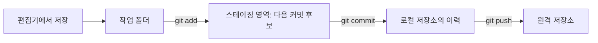

# 챕터 2 · Git으로 작업을 남기고 경험을 설명하기

> **상세 강의 원고:** 이 문서는 챕터 구조와 설계 이유다. 아래 8개 단원과 [통합 HTML](../../lecture.html)은 개념·강사 대본·읽기 사례를 담는다. 학생 명령 실행·풀이·제출·완성 예시는 [챕터 2 통합 실습](practice.md)에 모았다. Git 기술 설명은 원본 PDF에 없어 별도 추가했다.

## 단원별 상세 원고

1. [Git은 무엇인가](units/01-what-is-git.md)
2. [작업 폴더·stage·commit](units/02-working-state.md)
3. [설명할 수 있는 커밋](units/03-commits.md)
4. [변경 비교와 복구](units/04-recovery.md)
5. [브랜치·병합·충돌](units/05-branches.md)
6. [GitHub와 원격 저장소](units/06-remotes.md)
7. [작업 기록과 README](units/07-records.md)
8. [블로그와 포트폴리오](units/08-portfolio.md)

기준일: 2026-10-03, Asia/Seoul. 상세 기획 초안. 사용자는 기록·Git/GitHub·블로그·포트폴리오를 한 챕터로 묶고 Git 기초를 중심으로 다루기로 했다. 단원 구성·실습 난이도는 교육 제안이며 사용자 검토 전이다.

## 1 챕터의 목표

**내가 무엇을 바꿨고, 왜 바꿨으며, 무엇으로 확인했는지 남겨서 다른 사람이 이해하고 이어갈 수 있게 한다.**

합성 측정 자료의 단위·검증이라는 주제를 챕터 1과 연결한다. 챕터 2는 빈 폴더부터 작은 CSV와 README를 직접 준비하므로 챕터 1 프로그램의 존재나 완료 여부에 의존하지 않는다. 없는 프로그램의 실행 성과를 기록하지 않는다.

학습자는 다음을 수행한다.

1. Git과 GitHub의 역할을 자기 말로 설명한다.
2. 파일 저장·스테이징·커밋·원격 전송을 구분한다.
3. diff를 읽고 한 가지 목적의 변경을 선택해 커밋한다.
4. 이전 이력을 찾아보고 상황에 맞는 되돌리기를 선택한다.
5. 브랜치에서 작업하고 병합·충돌 상황을 설명한다.
6. 공유할 파일을 고르고 원격 저장소와 변경을 주고받는다.
7. 기록을 README·회고·포트폴리오 소개로 재구성한다.

### 최종 산출물

- 목적이 구분되는 변경 이력을 가진 연습 저장소.
- 입력·사용법·검증·한계가 있는 README.
- 문제 하나를 해결한 작업 기록과 이를 바탕으로 한 짧은 회고.
- 본인 기여와 증거를 연결한 프로젝트 소개 한 장.
- GitHub 공유를 수행했다면 해당 저장소·PR. 미수행이면 로컬 실습 결과와 미수행 이유.

GitHub 공개·블로그 발행·별도 포트폴리오 사이트 개설은 통과 조건으로 강제하지 않는다. 기록의 내용과 검증 가능한 설명을 먼저 평가한다.

## 2 범위와 진행 방식

전체 실습의 중심을 Git에 두고, 기록·글쓰기·포트폴리오는 같은 과제의 결과를 정리하며 연결한다. 시간 배분보다 학생이 상태 변화를 설명할 수 있는지를 기준으로 진행한다.

**수업 순서: 챕터 1 전체 강의 → 챕터 1 실습 → 챕터 2 전체 강의 → 챕터 2 실습.** 챕터 2의 1~8단원을 먼저 설명한다. 강사는 별도 시연 저장소로 상태 변화를 보여주며 학생에게 그 자리에서 폴더·커밋·문서를 만들게 하지 않는다. 아래 학생 결과물·통과 기준은 모두 챕터 말 통합 실습에서 확인한다. 강의 단원에는 학생 실습 완료를 선행 조건으로 두지 않는다.

통합 실습은 작업 위치 확인·CSV 뜻과 단위·합성 이유·손계산·초기 파일 네 개 생성부터 시작한다. Git 작성자 정보는 해당 연습 저장소에만 설정한다. [초기 README](materials/starter-README.md)는 실습 8의 완성 README와 구분한다. 실행마다 시작 상태·예측·확인·막힘·관찰 기록을 둔다.

| 단원 | 핵심 질문 | 학생 결과물 |
|---|---|---|
| 1. Git이란 무엇인가 | 왜 파일 이름을 늘려 저장하는 것만으로 부족한가? | 버전 관리·Git·GitHub 설명 |
| 2. 저장소와 작업 상태 | 지금 내 변경은 어디에 있는가? | 작업 폴더·스테이징·커밋 상태도 |
| 3. 변경을 읽고 커밋하기 | 이번 기록에 무엇을 넣을 것인가? | 검토한 diff와 의미 있는 커밋 |
| 4. 이력 찾기와 되돌리기 | 무엇을 보존하며 무엇을 되돌릴 것인가? | 상태별 복구 시연 |
| 5. 브랜치와 병합 | 작업을 나누고 어떻게 다시 합치는가? | 분기·충돌·해결 기록 |
| 6. GitHub로 공유하기 | 내 컴퓨터와 원격 저장소는 어떻게 다른가? | 원격 상태 비교와 PR 설명 |
| 7. 작업 기록과 README | 다른 사람이 무엇을 읽으면 이어갈 수 있는가? | 기록과 사용 설명 |
| 8. 블로그와 포트폴리오 | 내 경험에서 무엇을 어떤 증거로 설명할 것인가? | 회고 초안과 프로젝트 소개 |

### 난이도 조절

- **필수:** 1~4, 6의 기본 공유 개념, 7~8. 브랜치는 만들기·이동·병합까지 직접 해본다.
- **강사와 함께:** 충돌 해결, PR 검토, 두 작업 복사본 사이의 동기화.
- **후속 심화:** rebase, cherry-pick, stash, reflog, bisect, Git LFS, hook·CI, 복잡한 팀 브랜치 전략. 기본 명령과 섞어 한꺼번에 외우게 하지 않는다.

명령행은 상태 변화를 설명하기 위한 공통 기준으로 쓴다. 학생이 사용하는 편집기나 Git GUI에서도 같은 변경·스테이징·커밋을 찾아보게 한다. 특정 UI의 버튼 위치는 환경 확인 뒤 제작한다.

## 단원 1 Git이란 무엇인가

### 도입 장면

강사가 `analysis.py`, `analysis_final.py`, `analysis_final2.py`, `analysis_real_final.py`를 보여준다.

학생에게 묻는다.

- 어떤 파일이 현재 기준인가?
- 지난주에 정상 작동한 버전은 무엇인가?
- 단위 변환을 누가, 왜 바꿨는가?
- 두 사람이 따로 수정한 내용을 어떻게 합칠 것인가?

학생이 문제를 느낀 뒤 용어를 소개한다. 파일 개수를 줄이는 효과보다 변경의 맥락과 관계를 추적하는 데 초점을 둔다.

### 첫 설명 문장

> Git은 파일의 버전을 기록하고, 변경을 비교하고, 여러 작업 흐름을 합칠 수 있게 하는 분산 버전 관리 시스템이다.

- **버전 관리:** 의미 있는 시점의 상태를 남기고 이전 상태와 비교하는 일.
- **분산:** 일반적인 clone은 내 컴퓨터에도 저장소 이력을 가져오므로 많은 작업을 로컬에서 할 수 있다. 일부 이력만 받는 특수 옵션은 심화에서 다룬다.
- **커밋:** 기록 대상으로 선택한 프로젝트 상태를 설명·작성 정보·부모 커밋 관계와 함께 남기는 단위.

Git의 개념 모델은 스냅샷이다. 매번 폴더 전체를 물리적으로 복사한다는 뜻은 아니며, 선택하지 않은 새 파일까지 자동 기록되는 것도 아니다. 두 시점의 차이는 비교해서 확인한다. [Git 개념](https://git-scm.com/book/en/v2/Getting-Started-What-is-Git%3F), [용어](https://git-scm.com/docs/gitglossary).

### Git과 주변 도구 구분

| 대상 | 역할 | 학생이 할 수 있는 일 |
|---|---|---|
| 편집기 | 파일 내용을 작성·저장 | 코드·문서 수정 |
| Git | 로컬 변경 이력 관리 | commit·diff·branch·merge |
| GitHub | Git 저장소 호스팅과 협업 기능 | 공유·PR·Issue·검토 |
| 파일 백업 | 별도 위치에 복구용 자료 보관 | 장치 손실 등에 대비 |

GitHub 계정 없이도 Git으로 커밋할 수 있다. 로컬 커밋을 원격에 보내지 않았다면 GitHub에서 보이지 않는다. Git은 저장 버튼을 누를 때마다 모든 수정과 파일을 자동 보관하지 않는다. 커밋·백업하지 않은 작업이 반드시 복구된다고 가르치지 않는다. [GitHub와 Git](https://docs.github.com/en/get-started/start-your-journey/what-is-github).

### 오해 점검과 통과 기준

학생이 “Git은 업로드 사이트다”, “commit하면 상대 컴퓨터에 바로 생긴다”, “기록이 있으니 결과도 맞다”를 각각 고쳐 말한다. 기준 답은 버전 관리·원격 전송·결과 검증의 역할을 구분하는 것이다.

## 단원 2 저장소와 작업 상태 이해하기

### 먼저 준비할 것

폴더·파일·경로, 터미널의 현재 위치, 파일 저장을 확인한다. 경로 확인 없이 명령을 따라 입력하게 하지 않는다. 연습은 실제 연구 자료가 없는 새 폴더에서 시작한다.

- `git --version`: 설치 여부 확인.
- `git init -b main`: 새 연습 저장소 시작. `main`은 이번 실습에서 정한 브랜치 이름이다.
- `git clone`: 기존 저장소에서 작업을 시작하는 별도 경로. 같은 연습에서 init과 clone을 연속 실행할 필요는 없다.
- 이름·이메일은 커밋 작성 정보다. GitHub 로그인이나 접근 권한과 구분한다.
- 기본 예제는 저장소별 `--local` 설정을 쓴다. `--global`은 여러 저장소에 영향을 주므로 범위를 설명한 뒤 선택한다.

근거: [init](https://git-scm.com/docs/git-init), [config](https://git-scm.com/docs/git-config).

### 세 영역을 먼저 그리기

| 용어 | 이 수업의 설명 | 확인 방법 |
|---|---|---|
| Repository | 버전 관리에 필요한 이력·정보가 있는 저장소 | 일반적인 init 폴더의 `.git`, Git 명령 |
| Working tree | 현재 꺼내 놓고 편집하는 파일들 | 편집기·파일 내용 |
| Staging area / index | 다음 커밋에 담을 상태를 준비하는 영역 | `git diff --staged` |
| Commit | 기록된 상태와 메타데이터 | `git log`, `git show` |
| HEAD | 보통 현재 작업 중인 브랜치를 가리키는 참조 | `git status`, `git log --decorate` |

`.git`은 수업 중 직접 편집하거나 삭제하지 않는다. 위 그림은 기본 저장 흐름이며 fetch·병합 등의 역방향 작업은 뒤에서 추가한다. [변경 기록](https://git-scm.com/book/en/v2/Git-Basics-Recording-Changes-to-the-Repository).

### 핵심 시연

README를 저장→add→다시 수정→commit한다. **커밋에는 add 시점의 내용이 들어가고, 그 뒤의 수정은 별도로 남는지** 학생이 예측한 뒤 확인한다. 같은 파일이 staged이면서 modified일 수 있다는 점을 직접 보여준다. [git add](https://git-scm.com/docs/git-add).

통과 기준: “저장했으니 커밋됐다”라고 말하지 않고, 지금 내용이 어느 영역에 있는지 설명한다.

## 단원 3 변경을 읽고 의미 있게 커밋하기

### 기본 작업 순환

1. `git status`로 브랜치와 변경 파일을 확인한다.
2. 파일을 수정·저장한다.
3. `git diff`로 아직 스테이징하지 않은 변경을 읽는다. 새 untracked 파일의 본문은 편집기로 따로 확인한다.
4. 필요한 파일을 `git add 파일명`으로 선택한다.
5. `git diff --staged`로 이번 커밋에 들어갈 변경을 확인한다.
6. 검증 후 설명을 붙여 commit하고, 다시 status·log를 확인한다.

`git diff`가 비어 있어도 staged 변경이나 새 파일이 있을 수 있다. 기본 diff는 작업 폴더와 스테이징을, `--staged`는 스테이징과 HEAD를 비교한다. [diff](https://git-scm.com/docs/git-diff).

### 커밋 단위와 메시지

- 하나의 목적을 설명할 수 있는 크기로 묶는다. 코드와 그 코드의 테스트·설명은 함께 바뀔 수 있다.
- 무관한 파일 정리와 버그 수정을 한 커밋에 섞지 않는다.
- 좋은 예: `fix: 전압 평균 계산 전 mV를 V로 변환`.
- 부족한 예: `수정`, `최종`, `AI가 해줌`.
- `feat:`, `fix:`, `docs:`는 선택 가능한 팀 규칙이다. Git이 요구하는 문법으로 외우게 하지 않는다.

실습에서는 파일을 명시해 add한다. `git add .`가 편리한 이유와 원하지 않는 파일까지 포함할 수 있는 이유는 상태를 읽을 수 있게 된 뒤 설명한다.

### 관리할 파일 고르기

소스·설명·검증용 작은 샘플은 기록하고, 재생성 가능한 산출물·환경 폴더·비밀 설정은 목적에 맞게 제외한다. `.gitignore`는 이미 추적 중인 파일이나 과거 커밋을 지우지 않는다. 큰 연구 데이터는 원자료 관리 위치·버전·생성 조건을 문서에 남기며 별도 보관 방법을 정한다. [gitignore](https://git-scm.com/docs/gitignore).

### AI와 연결

AI가 바꾼 파일도 사람이 diff와 검증 결과를 확인한다. 커밋 메시지 초안은 AI가 도울 수 있지만 실행하지 않은 테스트를 통과했다고 쓰지 않는다. 첫 실습은 학생이 직접 상태를 읽고 명령을 실행한 뒤 AI 설명과 비교한다.

통과 기준: 커밋 직전 포함될 파일과 바뀐 의미를 말하고, 커밋 뒤 실제 이력에서 확인한다.

## 단원 4 이력을 읽고 실수 되돌리기

### 먼저 묻는 세 가지

1. 변경은 아직 작업 폴더에 있는가, staged인가, 이미 commit됐는가?
2. 내용은 남기고 선택만 취소하려는가, 내용 자체를 버리려는가?
3. 해당 커밋은 다른 사람과 공유됐는가?

### 읽기와 되돌리기 구분

| 상황 | 첫 확인 | 수업에서 다룰 행동 |
|---|---|---|
| 누가 무엇을 기록했는지 찾기 | `git log --oneline --decorate` | 커밋을 골라 `git show`로 변경 확인 |
| 잘못 add했지만 내용은 보존 | status·staged diff | `git restore --staged -- 파일명` |
| 연습 파일의 미커밋 수정을 버리기 | diff·보존 여부 | `git restore -- 파일명` |
| 이미 커밋한 잘못된 변경을 상쇄 | 대상 커밋·현재 상태 | `git revert`로 새 커밋 생성 |

`restore --staged` 예제는 첫 커밋이 존재하는 상태에서 진행한다. 기본 `restore`는 작업 파일을 스테이징 내용에 맞추므로 미커밋 수정이 사라질 수 있다. `revert`는 과거 이력을 삭제하지 않으며 상황에 따라 충돌할 수 있다. 명령 이름만 보고 일괄 적용하지 않는다. [restore](https://git-scm.com/docs/git-restore), [revert](https://git-scm.com/docs/git-revert), [log](https://git-scm.com/docs/git-log).

`reset --hard`, `clean -fd`, force push는 기본 복구 절차에 넣지 않는다. 학생이 AI의 제안을 받으면 적용 대상·사라질 내용·공유 여부부터 확인하도록 가르친다.

통과 기준: 스테이징 취소와 내용 폐기를 구분하고, 잘못된 커밋과 그것을 상쇄한 새 커밋을 둘 다 찾아낸다.

## 단원 5 브랜치에서 작업하고 병합하기

### 개념

브랜치는 작업 이력의 끝을 가리키는 이름으로 이해한다. 새 폴더 전체를 복제하는 작업으로 설명하지 않는다. 같은 작업 폴더에서 브랜치를 전환하면 보이는 파일 상태가 바뀔 수 있다. 전환 전에 status를 확인하고 작업을 정리한다. [용어](https://git-scm.com/docs/gitglossary), [switch](https://git-scm.com/docs/git-switch).

### 순서

1. 현재 main과 파일 상태를 확인한다.
2. `git switch -c docs/units`로 작업 브랜치를 만든다.
3. 단위 설명을 수정하고 검토·커밋한다.
4. main으로 돌아와 내용 차이를 확인한다.
5. main에서 작업 브랜치를 merge하고 이력 그래프를 읽는다.

main이 그동안 바뀌지 않았다면 fast-forward로 이름의 위치만 앞으로 갈 수 있다. 두 쪽에 별도 커밋이 있으면 이력을 합치는 병합이 필요하다. “merge하면 항상 병합 커밋 하나가 생긴다”로 설명하지 않는다.

### 충돌 시연

같은 문장의 단위 설명을 두 브랜치에서 다르게 고친다. Git이 멈췄을 때 status와 충돌 표시를 읽고, 원자료·요구사항에 맞는 문장으로 정리한다. 양쪽 내용을 무조건 합치거나 한쪽을 무조건 선택하지 않는다. 표시 제거→내용 검증→add→commit까지 진행한다. 깨끗한 상태에서 시작한 시연에서는 `git merge --abort`로 이번 병합을 중단하는 방법도 다룬다. [브랜치와 병합](https://git-scm.com/book/en/v2/Git-Branching-Basic-Branching-and-Merging).

통과 기준: 어느 브랜치로 무엇을 합쳤는지 설명하고, 충돌이 없어도 의미상 오류가 생길 수 있어 결과 검증이 필요함을 말한다.

## 단원 6 GitHub로 공유하고 함께 검토하기

### 로컬과 원격

| 행동 | 의미 |
|---|---|
| clone | 기존 저장소를 새 작업 위치로 가져와 시작 |
| remote | 다른 저장소의 주소에 붙인 이름·설정 |
| push | 로컬 커밋을 원격 브랜치에 전달 |
| fetch | 원격의 새 이력과 참조를 가져옴. 현재 작업 브랜치에 바로 통합하지 않음 |
| pull | fetch 후 지정한 방식으로 현재 브랜치에 통합 |

`origin`은 흔히 쓰는 원격 이름이다. `origin/main`은 마지막으로 가져온 원격 상태를 나타내는 로컬 참조이므로 원격의 실시간 상태와 다를 수 있다. 수업은 `pull --ff-only`를 명시해 이력이 갈라졌을 때 자동 통합하지 않고 멈추게 한다. 원격 동기화는 폴더의 모든 파일을 자동 동기화하는 기능으로 설명하지 않는다. [fetch](https://git-scm.com/docs/git-fetch), [pull](https://git-scm.com/docs/git-pull).

### GitHub 첫 사용 흐름

1. GitHub 로그인과 Git 커밋 작성 정보의 차이를 확인한다.
2. 공유 가능한 합성 자료로 빈 연습 저장소를 만든다.
3. 주소·대상 브랜치·공개 범위를 확인하고 로컬 이력을 push한다.
4. 웹에서 파일과 커밋이 보이는지 확인한다.
5. 다른 폴더에 clone해서 README와 파일이 재현되는지 확인한다.

인증은 사용하는 도구에 맞춰 GitHub CLI·자격 증명 관리자·SSH 등의 공식 경로를 선택한다. 계정 암호나 토큰을 문서·대화·원격 URL에 붙여 넣지 않는다. 실습 전 계정·조직 권한을 확인한다. [인증](https://docs.github.com/en/authentication/keeping-your-account-and-data-secure/about-authentication-to-github), [push](https://docs.github.com/en/get-started/using-git/pushing-commits-to-a-remote-repository).

### PR과 협업 최소 과정

작업 브랜치→수정·검증→push→Pull Request→diff 검토→반영의 흐름을 보여준다. PR은 GitHub에서 변경을 제안하고 검토하는 단위이며 `git pull` 명령과 구분한다. PR 설명은 문제·변경·검증·남은 한계만으로 시작한다. Issue는 할 일·문제·완료 조건을 남기는 곳으로 소개한다. [GitHub flow](https://docs.github.com/en/get-started/using-github/github-flow).

실제 연구실 자료는 담당자와 공유 범위를 먼저 확인한다. private 저장소도 외부 서비스에 데이터를 전송하는 것이므로 반출 허용 여부와 별개다. 처음에는 합성 CSV를 사용한다. 계정 준비가 안 되면 로컬 원격 실습으로 개념을 확인하고 GitHub 인증·PR은 미수행으로 기록한다.

통과 기준: 로컬 커밋과 원격 반영을 각각 확인하고, push가 거절됐다고 force push부터 시도하지 않는다.

## 단원 7 작업 기록과 README 만들기

### 기록마다 답하는 질문

| 기록 | 주된 독자·질문 |
|---|---|
| 커밋 | 변경을 검토할 사람: 무엇을 바꿨는가? |
| 작업 기록 | 미래의 나·동료: 왜 그렇게 했고 무엇을 확인했는가? |
| README | 처음 보는 사람: 무엇이며 어떻게 사용·검증하는가? |
| 회고·블로그 | 학습 과정을 읽을 사람: 무엇을 배웠고 어디에 적용할 수 있는가? |
| 포트폴리오 | 내 경험을 평가할 사람: 어떤 문제에서 무엇을 맡고 어떤 근거를 남겼는가? |

같은 설명을 다섯 번 새로 쓰게 하지 않는다. 작업 중 근거를 남기고 독자에 맞게 선별한다. 이번 Git 실습의 실제 관찰을 재료로 쓴다. 챕터 1 기록이 있으면 추가로 연결할 수 있다.

### 수업용 최소 작업 기록

문제 → 관찰 → 시도·선택 이유 → 바뀐 파일·커밋 → 실제 검증 → 한계·다음 행동. AI 출력 전체를 복사하기보다 본인의 판단과 확인 근거를 남긴다.

### README에 넣을 내용

목적·대상, 입력 형식·단위, 실행 환경·방법, 예시 출력·예상값, 오류 처리, 현재 구현 범위, 본인·AI의 역할과 미검증 사항을 적는다. 설치·실행 방법이 없거나 실제로 존재하지 않는 명령을 넣은 README는 완성으로 평가하지 않는다. [README의 역할](https://docs.github.com/en/repositories/managing-your-repositorys-settings-and-features/customizing-your-repository/about-readmes).

짝에게 새 복사본을 주고 README만으로 이해·실행해보게 한다. 프로그램이 없는 Git 기초 실습에서는 파일 목적과 손계산 검증까지만 평가하고 프로그램 재실행으로 기록하지 않는다.

통과 기준: 다른 사람이 입력·단위·검증·한계를 찾고, 기록한 사실과 추측을 구분할 수 있다.

## 단원 8 기록을 블로그와 포트폴리오로 바꾸기

### 한 사건으로 두 결과물 만들기

예시 사건: “mV를 V로 변환하지 않아 평균값의 단위를 잘못 보고했다.” 실제 겪지 않았다면 **수업용 오류 재현 사례**로 표시한다.

- 회고: 문제를 발견한 상황, 예상과 실제, 원인 후보, 확인 과정, 수정, 남은 한계.
- 프로젝트 소개: 해결한 문제, 본인 담당, 핵심 판단, 결과 근거, 저장소·관련 기록, 배운 점.

수치를 쓰면 기준과 측정 방법을 붙인다. 측정하지 않은 시간 절약·정확도 향상을 만들지 않는다. `코드 1,000줄 작성`이나 커밋 수보다 설명할 수 있는 기능·검증·판단을 근거로 삼는다.

### AI 활용과 기여 설명

“AI 사용” 한 줄에 그치지 않고 무엇을 요청했고 어떤 오류를 발견했으며 무엇을 직접 선택·검증했는지 적는다. AI가 실행하지 않은 테스트를 요약문에 넣거나 사용자 본인의 구현으로 바꾸어 적지 않게 검토한다.

### 기본 공개 준비

공개 가능한 자료만 골라 비공개 원자료·식별 정보·비밀 설정을 제외한다. 외부 코드·도표를 사용했다면 출처와 사용 조건을 확인한다. 공개가 어렵다면 합성 예제나 허용된 범위의 설명으로 본인 판단을 보여준다.

통과 기준: 소개문 속 주장 세 개를 각각 파일·커밋·검증 결과에 연결한다. 블로그 플랫폼 선택·디자인·도메인·배포는 이번 기본 수업의 필수 내용이 아니다.

## 종합 실습과 평가

진행: 상태 예측→직접 조작→관찰→짧은 설명→기록. 구체적 입력·명령·예상 상태는 [실습안](practice.md)에 있다.

| 평가 | 통과 증거 |
|---|---|
| 개념 | Git/GitHub, save/add/commit/push를 구분 |
| 변경 검토 | staged와 unstaged 차이를 읽고 선택한 파일만 커밋 |
| 복구 | 내용 보존 여부를 설명하고 적절한 되돌리기 수행 |
| 분기·공유 | 브랜치와 원격 상태를 구분, 병합 결과 확인 |
| 재현·기록 | README와 기록으로 다른 사람이 작업을 이해 |
| 경험 설명 | 본인 판단과 실제 증거를 연결하고 미검증을 표시 |

명령 암기 수·커밋 수·공개 게시물 수를 점수로 삼지 않는다. 핵심 구분을 설명하지 못하면 해당 시연으로 돌아간다. GitHub 계정 문제와 Git 개념 이해는 별도로 기록한다.

## 강사가 준비할 것과 남은 작업

- 학생 운영체제, Git 설치·버전, 편집기·터미널 수준, 계정·인증·기관 공유 정책 확인.
- README·합성 CSV와 예측표, 깨끗한 연습 폴더, 의도적으로 만든 충돌 사례.
- 원격 실습은 GitHub와 계정 없는 로컬 대체 경로를 구분.
- 강의 8단원이 끝난 뒤 통합 실습에서 학생이 직접 반복하고 상태를 설명하는 시간 확보.
- 챕터 1의 실제 측정 프로그램이 준비되면 기록 실습에 연결. 현재는 존재한다고 가정하지 않음.

공식 출처·검증 범위는 [sources.md](sources.md), 작업 결과는 프로젝트의 최신 기록을 참고한다. 이 문서는 교육 설계이며 학생 수업 수행·GitHub 공개 완료를 의미하지 않는다.
